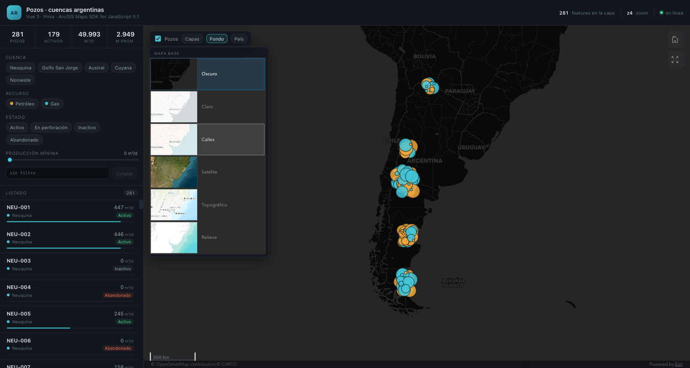

# Pozos — cuencas argentinas

Visor de pozos hidrocarburíferos sobre las cinco cuencas productivas argentinas, construido con **Vue 3 (Composition API) + Pinia + ArcGIS Maps SDK for JavaScript 5.1**.

**En vivo:** [vue-arcgis-demo.vercel.app](https://vue-arcgis-demo.vercel.app)



> Los datos de pozos son **simulados** y generados de forma determinista en el cliente. No representan ubicaciones, producciones ni operadoras reales.

## Qué demuestra

| Tema | Dónde mirarlo |
|---|---|
| Ciclo de vida del `MapView` en Vue | `src/composables/useWellsMap.ts` |
| Por qué el mapa **no** va en `ref()` / `reactive()` | `useWellsMap.ts`, `shallowRef` |
| Cleanup con `view.destroy()` | `onBeforeUnmount` |
| Del mapa hacia Vue: `reactiveUtils.watch` | zoom y estado `updating` |
| De Vue hacia el mapa: `watch` de Vue | filtros, selección, visibilidad |
| Filtrado en la capa con `definitionExpression` | `stores/wells.ts` + `useWellsMap.ts` |
| Consulta a la capa con `queryFeatureCount()` | contador "features en la capa" |
| `UniqueValueRenderer` + visual variable de tamaño | definición de la capa |
| Autocast del SDK | renderer y popupTemplate como objetos planos |
| **Componentes web de `@arcgis/map-components`** | `montarWidgets()` |
| `Basemap` propios con `WebTileLayer` y `TileLayer` | `crearBasemap()` |
| Galería con `LocalBasemapsSource` | `montarWidgets()` |
| Estado global con Pinia y `storeToRefs` | `stores/wells.ts`, `stores/map.ts` |
| Code splitting del SDK | `import()` dinámico en `onMounted` |

## Componentes del SDK incluidos

Desde la versión 4.31 Esri migró sus widgets a **componentes web**. Los que usa esta app:

`arcgis-legend` · `arcgis-layer-list` · `arcgis-basemap-gallery` · `arcgis-home` · `arcgis-scale-bar` · `arcgis-fullscreen`

Se montan sobre el `MapView` creado de forma imperativa, asignándoles la propiedad `view`. Eso permite quedarse con el control del ciclo de vida del mapa desde el composable y, al mismo tiempo, usar los componentes nuevos. Para que Vue no intente resolver `<arcgis-*>` como componentes propios hay que declararlos como custom elements en `vite.config.ts`:

```ts
vue({ template: { compilerOptions: { isCustomElement: (tag) => tag.startsWith('arcgis-') } } })
```

La lista de capas y la leyenda viven detrás del botón "Capas"; la galería de mapas base, detrás de "Fondo". El mapa queda despejado: los colores por recurso ya están en los chips de filtro del panel lateral, y tanto esos chips como el renderer de la capa toman los valores de `src/data/simbologia.ts`.

## Ejecutar

```bash
npm install
npm run dev
```

No requiere API key: los seis mapas base salen de servicios de teselas públicos. Ver "Decisiones técnicas".

```bash
npm run build      # vue-tsc + vite build
npm run typecheck  # solo tipos
```

## Decisiones técnicas

**`shallowRef` para el `MapView` y las capas.** Es la regla más importante de la integración. Si el `MapView` entra en `ref()` o `reactive()`, el Proxy de Vue envuelve el grafo de objetos del SDK, rompe su sistema `Accessor` y arruina la performance. `shallowRef` guarda la referencia sin volver reactivo el contenido.

**Dos sistemas de observación, uno en cada dirección.** Los cambios que nacen en el mapa (zoom, `updating`) se observan con `reactiveUtils.watch()` del SDK y se copian a `ref()` para que el template los muestre. Los que nacen en la UI (filtros, selección) usan el `watch()` de Vue y escriben sobre las propiedades del SDK. Mezclarlos es la fuente habitual de bugs.

**Filtrado en la capa, no en el array.** El store expone `definitionExpression`, una cláusula SQL que se asigna a la capa. La lista lateral mantiene un espejo en cliente solo para renderizar el panel. El contador "features en la capa" sale de `queryFeatureCount()`, es decir, lo confirma la capa y no el estado de Vue. Contra un `FeatureServer` real, esto significa que el filtrado ocurre en el servidor y no viajan features de más.

**Capa client-side.** La capa se arma con `source` (un array de `Graphic`) en lugar de una `url`, para que la demo corra sin backend. La API es la misma: renderers, popups, `definitionExpression` y `queryFeatures` funcionan igual. Para apuntar a un servicio real basta reemplazar `source` y `fields` por `url`, y agregar autenticación si el servicio es de ArcGIS Enterprise.

**Import dinámico del SDK.** `@arcgis/core` pesa varios MB. Entra por `import()` dentro de `onMounted`, así Rollup lo saca del bundle inicial. Declararlo en `manualChunks` por nombre de paquete **rompe el build**: el paquete no expone un entry principal, solo subpaths.

**Seis mapas base propios, sin API key.** Un `Basemap` no tiene por qué venir del catálogo de Esri: se construye con cualquier servicio de teselas. Los tres primeros (oscuro, claro, calles) son servicios XYZ de CARTO consumidos con `WebTileLayer`; los tres siguientes (satélite, topográfico, relieve) son `MapServer` públicos de ArcGIS Online consumidos con `TileLayer`, que además aporta los metadatos y la atribución del propio servicio.

La galería los recibe por `source` con un `LocalBasemapsSource`. Sin eso intentaría leer los basemaps del portal, que sí requieren autenticación. Es el mismo mecanismo que se usa para ofrecer la cartografía base interna de una organización en lugar de la de Esri.

**Tema de los componentes, en dos niveles.** Los componentes web del SDK viven en shadow DOM, así que no se los alcanza con selectores desde afuera. Primero se redefinen sus tokens de Calcite (`--calcite-color-*`, `--calcite-font-size-*`) en `src/style.css`, que sí cruzan el shadow boundary por herencia. Para los widgets heredados que no exponen tokens para su fondo —la barra de escala, por ejemplo— se les adosa una hoja de estilo dentro de su propio shadow root vía `adoptedStyleSheets`; está en `tematizar()`, en el composable.

El límite de ese enfoque: la leyenda delega su contenido en sub-componentes con shadow propio, de modo que solo se alcanza su contenedor. Por eso quedó dentro del panel de capas, donde su tipografía nativa no compite con el resto de la interfaz.

**`min-height: 0` en los grid items.** Los items de un grid traen `min-height: auto`, así que la lista de 281 pozos estiraba la fila y el `MapView` terminaba creando un framebuffer WebGL del alto del contenido (~38.000 px), llenando la consola de `GL_INVALID_FRAMEBUFFER_OPERATION`. Es un problema clásico al combinar un mapa a pantalla completa con una lista con scroll.

## Estructura

```
src/
  components/
    AppHeader.vue        marca y estado del mapa en vivo
    FilterBar.vue        filtros por chips + cláusula SQL en vivo
    MapContainer.vue     MapView, componentes del SDK y controles
    SidePanel.vue        KPIs, filtros y listado sincronizado
    WellDetail.vue       ficha del pozo seleccionado
  composables/
    useWellsMap.ts       ciclo de vida del mapa y puente con los stores
  stores/
    wells.ts             datos, filtros, definitionExpression, KPIs
    map.ts               estado del MapView expuesto a la UI
  data/
    wells.ts             generador determinista de pozos
    simbologia.ts        colores y escalas del renderer, reutilizados en la UI
```

## Stack

Vue 3.5 · TypeScript (strict) · Pinia 3 · Vite 7 · @arcgis/core 5.1 · @arcgis/map-components 5.1
